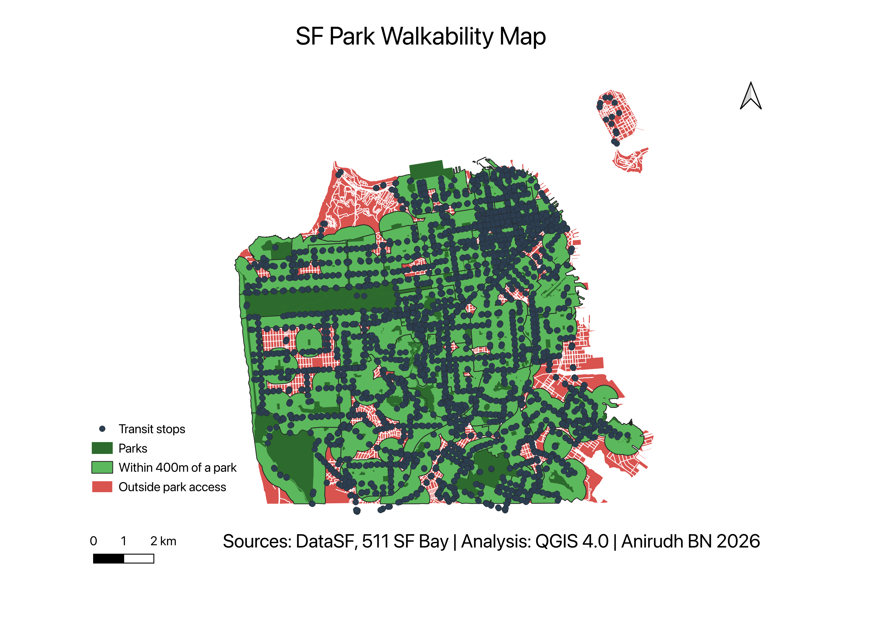

# SF Park Walkability Analysis

**Tools:** QGIS 4.0 | **Data:** DataSF, 511 SF Bay | **Year:** 2026  
**Author:** Anirudh BN

---

## Overview

This project analyses park accessibility across San Francisco's 41 neighbourhoods using GIS buffer analysis. The central question: **which SF neighbourhoods lack adequate access to parks within a comfortable walking distance?**

Park access is defined as being within **400 metres** (approximately a 5-minute walk) of any Recreation and Park Department property. Neighbourhoods where significant portions of residential land fall outside this threshold are identified as underserved.



---

## Key Findings

- The majority of SF's central and western neighbourhoods fall within 400m of a park, reflecting the city's dense park network.
- **Treasure Island** has no park coverage within the 400m threshold — it is completely outside walkable park access.
- Southeastern neighbourhoods including **Bayview-Hunters Point**, **Excelsior**, and parts of the **Outer Mission** show the largest red gaps — areas without park access.
- The **northern waterfront** (Marina, Presidio, Crissy Field corridor) shows the highest park accessibility density in the city.

---

## Data Sources

| Dataset | Source | Format |
|---|---|---|
| SF Analysis Neighbourhoods | [DataSF](https://data.sfgov.org/Geographic-Locations-and-Boundaries/Analysis-Neighborhoods/p5b7-5n3h) | Shapefile |
| Recreation and Park Properties | [DataSF](https://data.sfgov.org/Culture-and-Recreation/Recreation-and-Park-Department-Park-Info/z76i-7s65) | Shapefile |
| SFMTA Transit Stops (GTFS) | [511 SF Bay Open Data](https://511.org/open-data) | CSV (stops.txt) |
| Street Centerlines | [DataSF](https://data.sfgov.org) | Shapefile |

All data downloaded March 2026. All layers reprojected to **EPSG:7131 (NAD83(2011) / San Francisco CS13)** for accurate distance measurement.

---

## Methodology

### Step 1 — Data preparation
All four datasets were downloaded, unzipped, and reprojected from WGS84 (EPSG:4326) to the San Francisco local coordinate reference system (EPSG:7131) to ensure metric distance accuracy.

### Step 2 — Buffer analysis
A **400-metre buffer** was applied to all park polygons using QGIS Vector → Geoprocessing Tools → Buffer, with the Dissolve result option enabled to merge overlapping buffers into a single clean polygon.

### Step 3 — Intersection
The dissolved park buffer was intersected with the neighbourhood boundary layer to produce the walkable area within each neighbourhood boundary.

### Step 4 — Scoring
The walkable area per neighbourhood was calculated as a percentage of total neighbourhood area using the Field Calculator expression:

```
min( ("area_sum" / "area") * 100, 100 )
```

### Step 5 — Visualisation
The final map uses a binary visual approach: red areas represent land outside 400m park access; green areas represent the walkable buffer zone. This makes the coverage gaps immediately legible.

---

## Repository Structure

```
sf-walkability/
├── data/
│   ├── raw/
│   │   ├── neighborhoods/
│   │   ├── parks/
│   │   ├── transit/
│   │   └── streets/
│   └── processed/
│       ├── neighborhoods_7131.shp
│       ├── parks_7131.shp
│       ├── parks_buffer_dissolved.shp
│       ├── park_walkable_clean.shp
│       └── neighborhoods_final_scored.shp
├── outputs/
│   ├── sf-walkability-map.pdf
│   └── sf-walkability-map.png
├── sf-walkability.qgz
└── README.md
```

---

## How to Reproduce

1. Clone this repository
2. Download the four datasets listed above and place in `data/raw/`
3. Open `sf-walkability.qgz` in QGIS 3.x or later
4. All processed layers are included in `data/processed/` — no reprocessing needed
5. To re-run the analysis, follow the methodology steps above

**Note:** Transit stops data requires a free API key from [511.org/open-data](https://511.org/open-data). The stops.txt file is not included in this repo due to size.

---

## Part of SF Urban Planning Portfolio

This is Project 1 of a 4-project QGIS portfolio focused on San Francisco urban planning analysis:

1. **Park Walkability Analysis** ← this project
2. Land Use Change Detection (Sentinel-2 satellite imagery)
3. Flood & Sea Level Rise Risk Mapping (FEMA + USGS LiDAR)
4. Transit Equity Gap Analysis (SFMTA + US Census income data)
